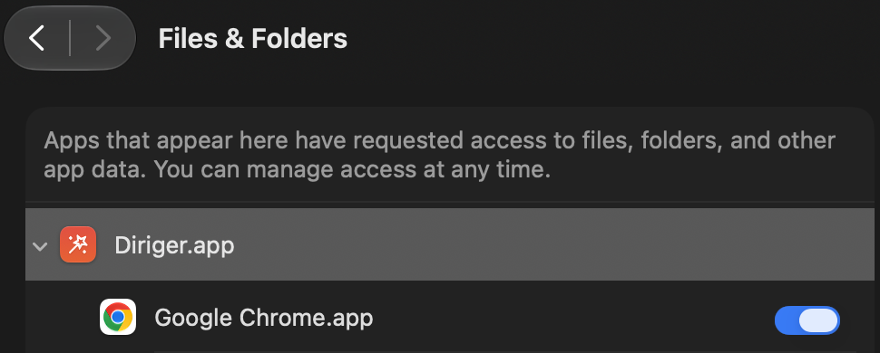

# Diriger

A lightweight macOS menu bar app for working with multiple Google Chrome profiles.

## Features

- **Profile switcher in the menu bar** — every Chrome profile is listed with its picture; click to switch.
- **Global keyboard shortcuts** — bind a shortcut to each of your first ten profiles.
- **Launch at login** — optional.
- **Set Diriger as your default browser** — when another app opens an `http(s)` URL, or you open a local HTML file from Finder, Diriger decides where it goes.
- **Routing rules** — pre-defined rules send matching URLs straight to a specific profile. Rule kinds:
  - **Source** — match by the app that opened the link (e.g. Slack → Work profile).
  - **Domain** — exact host (`github.com`) or suffix (`*.example.com`).
  - **RegEx** — any regex matched against the full URL.
  - First matching rule wins. Rules are reorderable in Settings.
- **Link picker** — for any link that doesn't match a rule, a small picker appears at the cursor. Pick a profile with the mouse, arrow keys + Return, or the number keys (1–9, 0 for the tenth). `⌘C` copies the URL. `Esc` dismisses.
- Profiles are read live from Chrome's `Local State` — no manual configuration.

## Requirements

- macOS 14.0+
- Google Chrome
- Accessibility permission (prompted on first profile switch — needed to activate the matching profile window in a running Chrome)
- On macOS 27 and later: access to Google Chrome's app data (see below)

### macOS 27: allow access to Chrome's data

macOS 27 protects Google Chrome's data folder (`~/Library/Application Support/Google/Chrome`) from other apps. Until Diriger is allowed in, it can't read Chrome's profile list and shows **No Chrome profiles found**.

To fix it:

1. Open **System Settings → Privacy & Security → Files & Folders**.
2. Expand **Diriger.app** and turn on **Google Chrome.app**.
3. Quit and relaunch Diriger. The profiles appear after the restart.



That's the only change needed. Routing rules and shortcuts stay as they were.

## Development

Install SwiftFormat via Homebrew, then run it from the repo root to apply the project style:

```bash
brew install swiftformat
swiftformat .
```

## Installation

### Homebrew

```bash
brew install volodymyrsmirnov/tap/diriger
```

### Download

1. Download the latest `.dmg` from [Releases](https://github.com/volodymyrsmirnov/diriger/releases/latest)
2. Open the `.dmg` and drag `Diriger.app` to `/Applications`

### Build from source

```bash
bash scripts/build-app.sh
```

Move the resulting `Diriger.app` to `/Applications`.

## Using Diriger as your default browser

Open Settings (menu bar → Settings…) and turn on **Use Diriger to open web links**. Any `http(s)` URL from another app — and any local HTML file opened from Finder — is now handed to Diriger, which either applies a matching rule or shows the picker. Turning the toggle on also makes Diriger the default app for local HTML files; turning it off hands both roles back to another installed browser.

Rules are only consulted when Diriger is the default browser. The Routing Rules section of Settings is disabled until then.

### Example rules

| Kind   | Pattern                | Profile |
|--------|------------------------|---------|
| Source | `com.tinyspeck.slackmacgap` | Work    |
| Domain | `*.corp.example.com`   | Work    |
| Domain | `github.com`           | Personal |
| RegEx  | `^https://mail\.google\.com/` | Personal |

## How profile switching works

Diriger reads Chrome's profile data from `~/Library/Application Support/Google/Chrome/Local State`.

- **Chrome not running**: launches Chrome with `--profile-directory` to open the correct profile.
- **Chrome running**: activates Chrome, then uses the Accessibility API to find and press the matching profile menu item by its Cocoa selector identifier (`switchToProfileFromMenu:`). The identifier is language-independent, so this works regardless of Chrome's UI language.

## Limitations

- Diriger supports up to ten profile shortcuts (keys 1–9, 0). Additional profiles still appear in the menu bar and picker but can't have bound shortcuts.
- Chrome Beta / Canary / Dev / Chromium forks are not supported — Diriger targets stable Google Chrome (`com.google.Chrome`).

## Tech Stack

- Swift / SwiftUI on macOS 14+, strict concurrency enabled
- [KeyboardShortcuts](https://github.com/sindresorhus/KeyboardShortcuts) by Sindre Sorhus

## License

MIT
